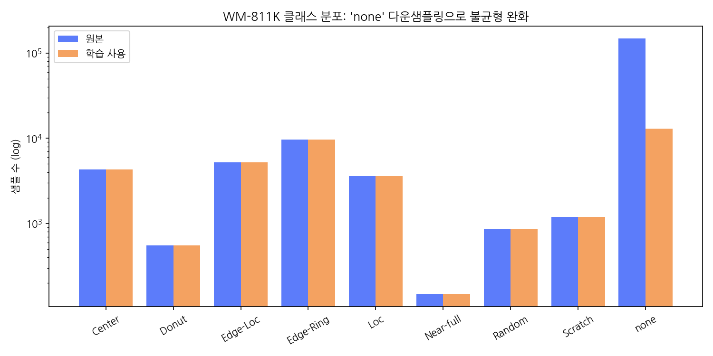
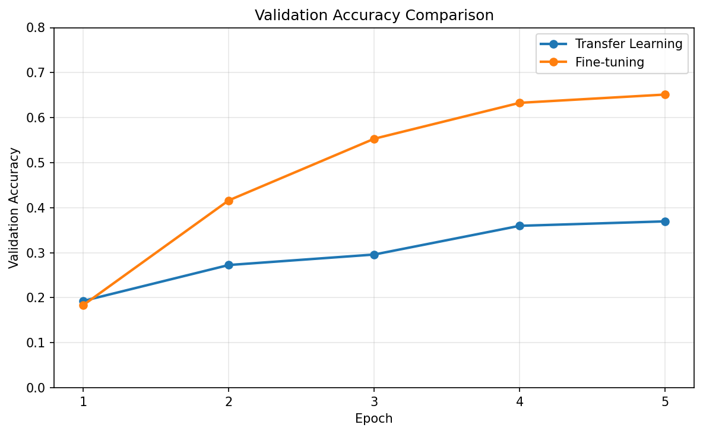
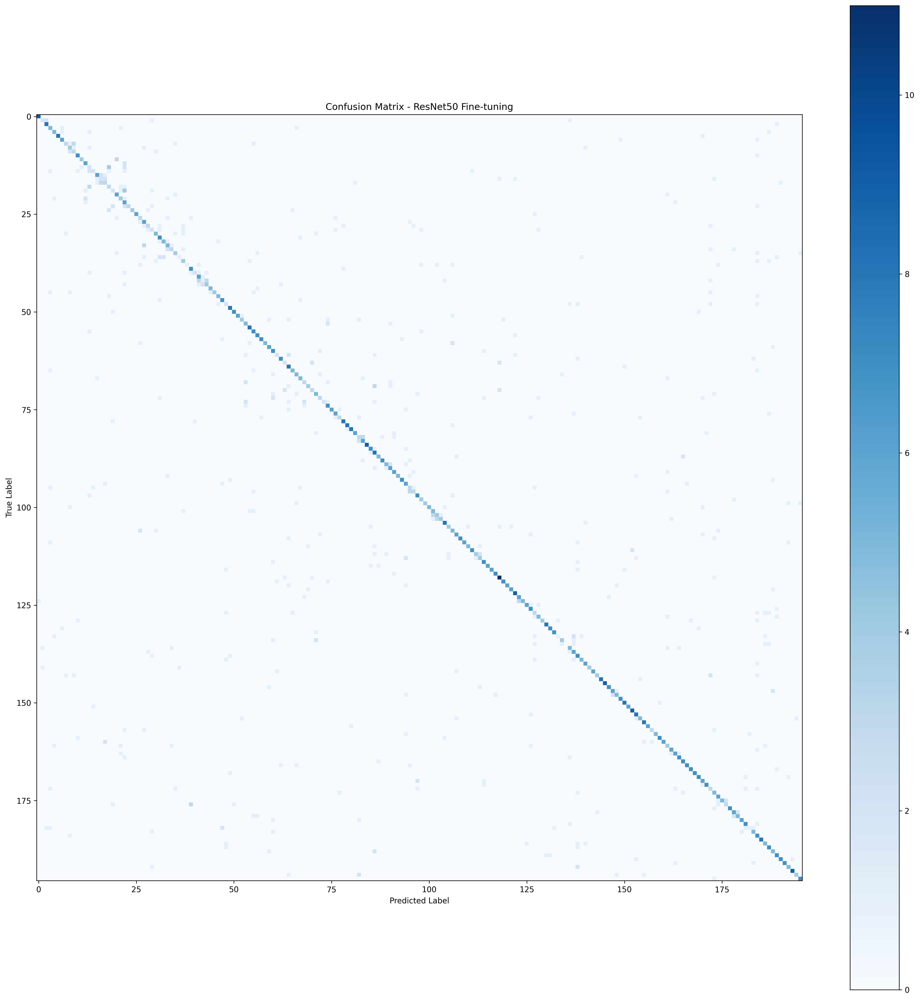
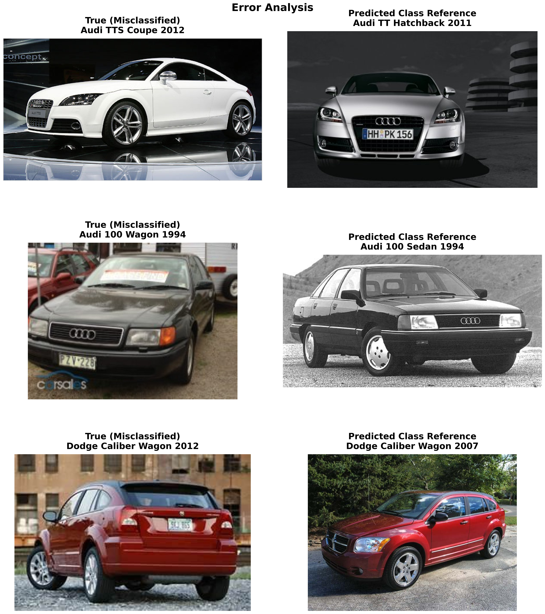
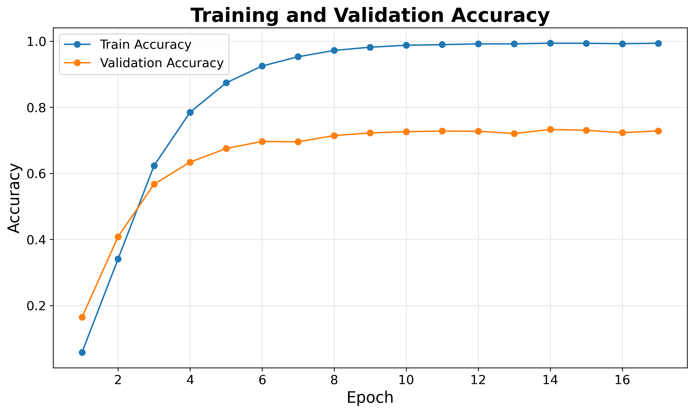
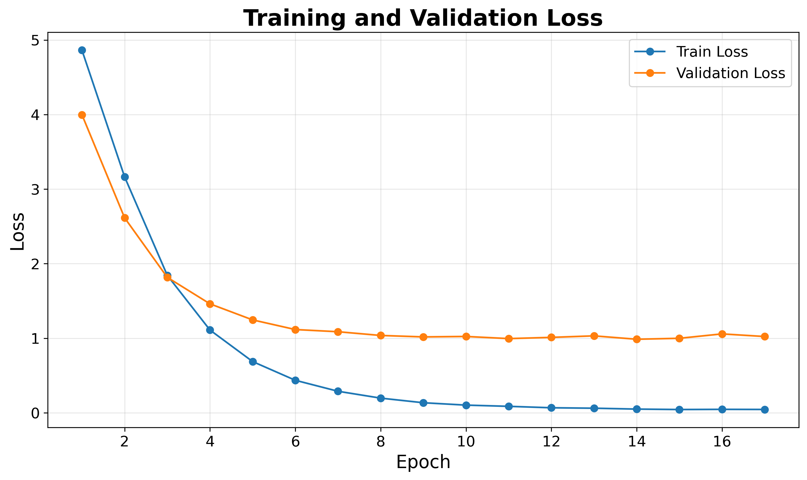
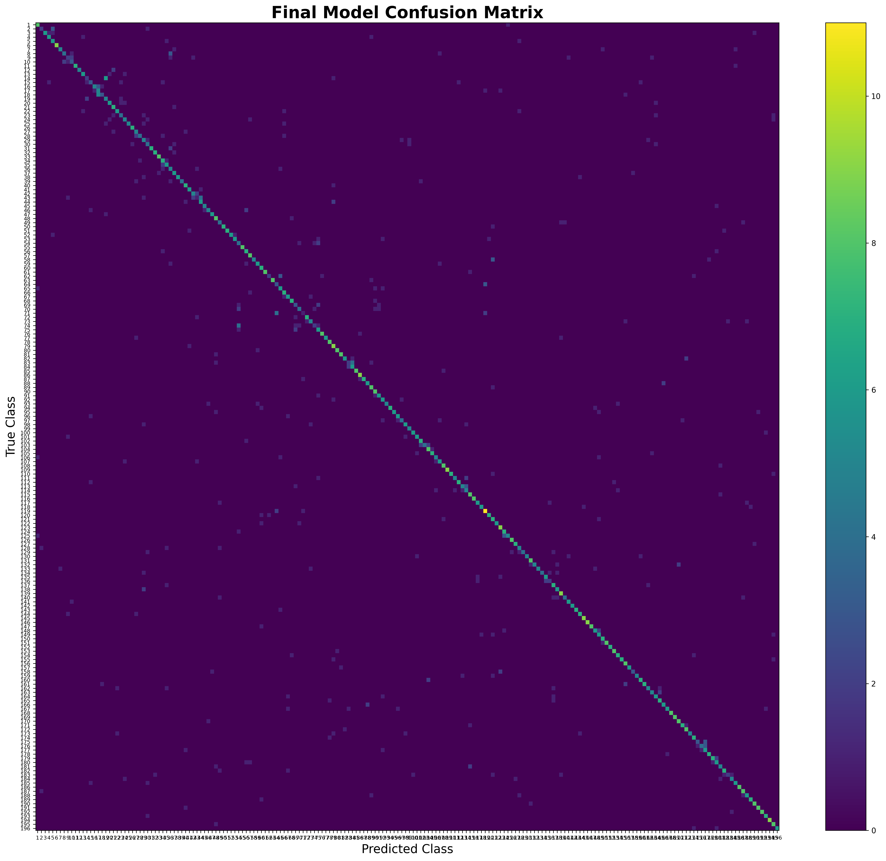

# Stanford Cars Fine-Grained Image Classification

## ResNet50 기반 자동차 차종 이미지 분류 및 성능 개선

> Stanford Cars Dataset을 활용하여 ResNet50 기반 자동차 차종 분류 모델을 구축하고,  
> Transfer Learning → Fine-tuning → Error Analysis → 데이터 전처리 가설 검증 → Early Stopping 기반 최종 학습까지 단계적으로 성능을 개선한 프로젝트입니다.

---

## 1. Project Overview

### 프로젝트 목적

자동차 이미지를 단순한 차량 종류가 아닌 **196개의 세부 차종(Class)** 으로 분류하는 Fine-Grained Image Classification 문제를 해결합니다.

Stanford Cars는 동일 브랜드 내에서도 외형이 유사한 차량이 여러 클래스로 구성되어 있어, 단순한 이미지 분류보다 **세부적인 시각적 특징을 학습하는 것이 중요한 데이터셋**입니다.

본 프로젝트에서는 ImageNet으로 사전학습된 ResNet50을 기반으로 단계적인 실험을 진행하고,

- Transfer Learning
- Fine-tuning
- Confusion Matrix 기반 Error Analysis
- 차량 영역 BBox Crop 가설 검증
- Early Stopping을 적용한 최종 학습

을 통해 모델의 성능 변화를 비교했습니다.

---

## 2. Dataset

### Stanford Cars Dataset

본 프로젝트에서는 Stanford Cars Dataset을 활용했습니다.

Stanford Cars는 자동차의 Make / Model / Year 수준의 세부 차종을 구분하는 Fine-Grained Image Classification 데이터셋입니다.

| 항목 | 내용 |
|---|---:|
| 전체 이미지 | 16,185 |
| Train | 8,144 |
| Test | 8,041 |
| Class | 196 |
| 학습/검증 분할 | 6,515 / 1,629 |
| Split 방식 | Stratified Split |
| Random State | 42 |

> 본 프로젝트에서 사용한 데이터 구성은 196개 클래스로 구성된 Stanford Cars 배포본을 기준으로 합니다.

### Data Audit

학습 전에 데이터셋 구조와 품질을 확인했습니다.

- Class 수: 196
- Train 이미지: 8,144장
- 클래스별 이미지 수 확인
- 이미지 누락 여부 확인
- 이미지 손상 여부 확인
- 이미지 채널 확인
- Grayscale 이미지 확인
- 클래스별 데이터 분포 확인

### Dataset Source

- **Dataset:** Stanford Cars Dataset
- **Authors:** Jonathan Krause, Jia Deng, Michael Stark, Li Fei-Fei
- **Affiliation:** Stanford University
- **Workshop:** Second Workshop on Fine-Grained Visual Categorization (FGVC), 2013

**Original Dataset / Project Page**

https://ai.stanford.edu/~jkrause/

**Reference**

Krause, J., Deng, J., Stark, M., & Fei-Fei, L.  
"Collecting a Large-Scale Dataset of Fine-Grained Cars."  
Second Workshop on Fine-Grained Visual Categorization (FGVC), 2013.

### Dataset Usage

원본 이미지 데이터셋은 GitHub 저장소에 직접 포함하지 않았습니다.

대신 데이터셋 출처와 프로젝트에서 사용한 데이터 구성을 명시하여 재현에 필요한 정보를 제공합니다.

```text
Dataset
└── Stanford Cars
    ├── Train : 8,144 images
    ├── Test  : 8,041 images
    └── Classes : 196
```

> ⚠️ 제공된 데이터 구성에서는 Test Set의 클래스 라벨을 확인할 수 없어, 본 프로젝트의 모델 성능 평가는 Train에서 분리한 Validation Set을 기준으로 수행했습니다.

### Data Distribution



---

## 3. Model

### ResNet50

ImageNet으로 사전학습된 ResNet50을 사용했습니다.

```text
Input Image
     ↓
ResNet50 Backbone
     ↓
2048-dimensional Feature
     ↓
Fully Connected Layer
     ↓
196 Classes
```

기존 ImageNet 분류기의 마지막 Fully Connected Layer를

```text
2048 → 1000
```

에서

```text
2048 → 196
```

으로 변경했습니다.

---

## 4. Preprocessing

### Train

```text
RandomResizedCrop(224)
RandomHorizontalFlip
ColorJitter
ImageNet Normalization
```

### Validation

```text
Resize(256)
CenterCrop(224)
ImageNet Normalization
```

Train 데이터에는 augmentation을 적용하고 Validation 데이터에는 동일한 평가 조건을 유지하기 위해 랜덤 augmentation을 적용하지 않았습니다.

---

## 5. Experiment 1 — Transfer Learning

먼저 ResNet50의 ImageNet pretrained backbone을 고정하고 마지막 FC Layer만 학습했습니다.

### 설정

| 항목 | 설정 |
|---|---|
| Backbone | ResNet50 |
| Pretrained | ImageNet |
| Backbone | Frozen |
| Trainable Layer | FC |
| Optimizer | AdamW |
| Learning Rate | 1e-3 |
| Weight Decay | 1e-4 |
| Batch Size | 32 |
| Epoch | 5 |

### Result

**Validation Accuracy: 36.96%**



Transfer Learning만으로는 Stanford Cars의 세부 차종을 충분히 구분하는 데 한계가 있음을 확인했습니다.

---

## 6. Experiment 2 — Fine-tuning

Transfer Learning 결과를 바탕으로 pretrained feature를 Stanford Cars 데이터에 맞게 추가로 조정했습니다.

전체 backbone을 학습시키는 대신,

```text
conv1 ~ layer3 : Frozen
layer4         : Trainable
FC             : Trainable
```

구조로 Fine-tuning을 진행했습니다.

### 설정

| 항목 | 설정 |
|---|---|
| Backbone | ResNet50 |
| Pretrained | ImageNet |
| Frozen | conv1 ~ layer3 |
| Trainable | layer4 + FC |
| Optimizer | AdamW |
| Learning Rate | 1e-4 |
| Weight Decay | 1e-4 |
| Batch Size | 32 |
| Epoch | 5 |

### Result

**Validation Accuracy: 65.13%**

Transfer Learning 대비:

**+28.17%p**

```text
Transfer Learning
36.96%
    ↓
Fine-tuning
65.13%
```

Fine-grained classification에서는 pretrained feature를 그대로 사용하는 것보다 대상 데이터에 맞게 일부 feature를 조정하는 과정이 중요함을 확인했습니다.

---

## 7. Error Analysis

Fine-tuning 모델의 오분류 패턴을 확인하기 위해 Confusion Matrix와 Confusion Pair를 분석했습니다.

### Confusion Matrix



196개 클래스의 전체 예측 결과를 Confusion Matrix로 확인했습니다.

특히 클래스 간 유사도가 높은 차량에서 오분류가 집중되는 패턴을 확인했습니다.

### 주요 Confusion Pair

예:

```text
Audi TTS Coupe 2012
        ↓
Audi TT Hatchback 2011

Audi S6 Sedan 2011
        ↓
Audi S4 Sedan 2012

Rolls-Royce Phantom Sedan 2012
        ↓
Bentley Arnage Sedan 2009
```

서로 외형이 유사한 차종 간 오분류가 발생하는 것을 확인했습니다.

---

## 8. Visual Error Analysis

Confusion Matrix에서 확인한 주요 오분류 사례를 실제 이미지로 확인했습니다.

각 사례는

```text
True Class의 실제 오분류 이미지
              VS
Model이 예측한 Class의 Reference Image
```

형태로 비교했습니다.



이를 통해 단순히 Accuracy 수치만 확인하는 것이 아니라, **어떤 클래스들이 서로 혼동되는지 실제 이미지 수준에서 분석**했습니다.

---

## 9. Experiment 3 — BBox Crop

### Hypothesis

Stanford Cars 이미지에서 차량 영역만 Crop하여 학습하면 배경의 영향을 줄이고 차량의 세부적인 특징에 집중할 수 있을 것이라고 가정했습니다.

### Approach

Train Annotation에 포함된 Bounding Box를 이용해 차량 영역을 Crop한 후 동일한 ResNet50 Fine-tuning 구조로 학습했습니다.

```text
Original Image
      ↓
Bounding Box Crop
      ↓
Resize / Augmentation
      ↓
ResNet50
      ↓
196 Classes
```

### Result

**Validation Accuracy: 56.78%**

```text
Full Image + Fine-tuning
65.13%

        ↓

BBox Crop + Fine-tuning
56.78%
```

기존 Full Image 방식보다 **8.35%p 낮은 결과**를 확인했습니다.

따라서 현재 데이터 전처리 및 학습 설정에서는 차량 영역만 사용하는 것이 성능 향상으로 이어지지 않았습니다.

> 이 실험을 통해 단순히 "차량 영역에 집중하면 성능이 좋아질 것"이라고 가정하지 않고, 실제 실험을 통해 가설을 검증했습니다.

---

## 10. Final Training

앞선 실험 결과를 바탕으로 최종 모델은 다음 구조를 사용했습니다.

```text
Full Image
    ↓
ResNet50 ImageNet Pretrained
    ↓
Freeze conv1 ~ layer3
    ↓
Fine-tune layer4 + FC
    ↓
Early Stopping
    ↓
196 Classes
```

### Training Configuration

| 항목 | 설정 |
|---|---|
| Model | ResNet50 |
| Pretrained Weight | ImageNet |
| Trainable Layer | layer4 + FC |
| Optimizer | AdamW |
| Learning Rate | 1e-4 |
| Weight Decay | 1e-4 |
| Batch Size | 32 |
| Maximum Epoch | 20 |
| Early Stopping Patience | 3 |
| Seed | 42 |

Validation Loss를 기준으로 Early Stopping을 적용하면서 학습을 진행했으며, 최종 모델은 **Validation Accuracy가 가장 높았던 Epoch 14 checkpoint**를 사용했습니다.

---

## 11. Final Result

### Experiment Comparison

| Experiment | Validation Accuracy |
|---|---:|
| Transfer Learning | 36.96% |
| Fine-tuning | 65.13% |
| BBox Crop + Fine-tuning | 56.78% |
| Final Fine-tuning + Early Stopping | **73.30%** |

### Performance Improvement

```text
Transfer Learning
36.96%
      ↓ +28.17%p
Fine-tuning
65.13%
      ↓
BBox Crop
56.78%
      ↓
Final Training
73.30%
```

5 Epoch Fine-tuning 모델과 비교했을 때 최종 모델은

**65.13% → 73.30%**

으로 **8.17%p 향상**되었습니다.

---

## 12. Final Training Curve

### Accuracy



### Loss



Train 성능은 지속적으로 상승한 반면 Validation 성능은 일정 시점 이후 변동하는 모습을 확인했습니다.

이에 따라 무조건 Epoch을 늘리는 대신 Early Stopping을 적용하여 Validation 성능을 기준으로 학습을 종료했습니다.

---

## 13. Final Confusion Matrix



최종 모델에서도 클래스 간 유사성에 따른 오분류 패턴을 확인할 수 있습니다.

특히 동일 브랜드 또는 차체 형태가 유사한 클래스 간 혼동이 주요 오류 유형으로 나타났습니다.

---

## 14. Project Pipeline

```text
┌──────────────────────┐
│ Stanford Cars Dataset│
└──────────┬───────────┘
           ↓
┌──────────────────────┐
│ Data Audit           │
│ 196 Classes          │
│ 8,144 Train Images   │
└──────────┬───────────┘
           ↓
┌──────────────────────┐
│ Train / Validation   │
│ 6,515 / 1,629        │
└──────────┬───────────┘
           ↓
┌──────────────────────┐
│ ResNet50             │
│ ImageNet Pretrained  │
└──────────┬───────────┘
           ↓
┌──────────────────────┐
│ Transfer Learning    │
│ 36.96%               │
└──────────┬───────────┘
           ↓
┌──────────────────────┐
│ Fine-tuning          │
│ layer4 + FC          │
│ 65.13%               │
└──────────┬───────────┘
           ↓
┌──────────────────────┐
│ Error Analysis       │
│ Confusion Matrix     │
│ Confusion Pair       │
└──────────┬───────────┘
           ↓
┌──────────────────────┐
│ BBox Crop Experiment │
│ 56.78%               │
└──────────┬───────────┘
           ↓
┌──────────────────────┐
│ Final Training       │
│ Early Stopping       │
│ 73.30%               │
└──────────────────────┘
```

---

## 15. Project Structure

```text
stanford-cars-resnet50/
│
├── README.md
│
├── images/
│   ├── confusion_matrix_196x196.png
│   ├── final_v2_accuracy_curve.png
│   ├── final_v2_confusion_matrix.png
│   ├── final_v2_error_analysis_3cases.png
│   ├── final_v2_loss_curve.png
│   ├── val_accuracy_comparison.png
│   └── val_loss_comparison.png
│
├── results/
│   ├── final_v2_metrics.csv
│   ├── final_v2_classification_report.csv
│   ├── final_v2_training_history.csv
│   ├── final_v2_top10_confusion_pairs.csv
│   └── final_v2_error_analysis_cases.csv
│
└── notebooks/
    ├── 01_data_audit.ipynb
    └── 02_resnet50_transfer_learning.ipynb
```

> 원본 데이터셋과 대용량 모델 checkpoint는 GitHub 저장소에 포함하지 않았습니다.

---

## 16. Reproducibility

Final Training에서는 Seed를 고정했습니다.

```python
SEED = 42
```

최종 모델 학습에 사용한 주요 설정은 다음과 같습니다.

- Model: ResNet50
- Pretrained Weight: ImageNet
- Fine-tuning: layer4 + FC
- Optimizer: AdamW
- Learning Rate: 1e-4
- Weight Decay: 1e-4
- Batch Size: 32
- Maximum Epoch: 20
- Early Stopping Patience: 3
- Seed: 42

> 최종 모델 checkpoint는 GitHub 저장소에 포함하지 않았으며, 학습 결과와 실험 재현에 필요한 설정 및 결과 파일을 저장소에서 제공합니다.

---

## 17. Key Learnings

### 1. Pretrained Model을 사용하는 것만으로 충분하지 않았다

ImageNet pretrained ResNet50의 FC Layer만 학습했을 때 Validation Accuracy는 36.96%였습니다.

Fine-tuning을 적용하면서 65.13%까지 향상되었고, 대상 데이터에 맞는 feature adaptation의 중요성을 확인했습니다.

### 2. Error Analysis를 통해 개선 방향을 결정했다

Confusion Matrix와 실제 이미지를 분석하여 모델이 어떤 클래스들을 혼동하는지 확인했습니다.

단순한 성능 수치가 아니라 **오류의 유형을 분석하는 과정**을 프로젝트에 포함했습니다.

### 3. 가설이 항상 성능 향상으로 이어지는 것은 아니다

차량 영역만 사용하면 성능이 향상될 것이라는 가설을 BBox Crop 실험으로 검증했습니다.

결과는 56.78%로 기존 Full Image 방식보다 낮았으며, 실험 결과를 근거로 최종 모델에는 BBox Crop을 적용하지 않았습니다.

### 4. 최종 학습에서는 Early Stopping을 적용했다

학습 Epoch을 단순히 늘리는 대신 Validation 성능을 관찰하고 Early Stopping을 적용하여 최종 모델을 선정했습니다.

---

## 18. Skills

### Deep Learning
- CNN
- ResNet50
- Transfer Learning
- Fine-tuning
- Image Classification
- Fine-Grained Classification

### Computer Vision
- Image Preprocessing
- Data Augmentation
- Bounding Box
- Confusion Matrix
- Error Analysis

### Python / Data
- Python
- PyTorch
- torchvision
- NumPy
- Pandas
- scikit-learn
- Matplotlib
- Pillow

### Experiment / Model Evaluation
- Train / Validation Split
- Accuracy
- Precision / Recall / F1
- Confusion Matrix
- Early Stopping
- Reproducible Experiment

---

## 19. Project Summary

**ResNet50 기반 Stanford Cars 196-Class Fine-Grained Classification**

데이터셋 품질을 확인한 후 ImageNet pretrained ResNet50을 기반으로 Transfer Learning과 Fine-tuning을 단계적으로 수행했습니다.

이후 Confusion Matrix와 실제 오분류 이미지를 이용해 Error Analysis를 진행하고, BBox Crop이라는 데이터 전처리 가설을 실험으로 검증했습니다.

최종적으로 `layer4 + FC Fine-tuning + Early Stopping` 구조를 적용하여

**Validation Accuracy 73.30%**

를 달성했습니다.

본 프로젝트를 통해 단순 모델 구현을 넘어

**데이터 검증 → 모델 설계 → 실험 → 오류 분석 → 가설 검증 → 최종 모델 선정**

까지의 딥러닝 프로젝트 workflow를 경험했습니다.

---

## 20. Limitations

- Stanford Cars Test Set의 Ground Truth Label이 제공되지 않아 Test Accuracy를 산출하지 않았습니다.
- 최종 성능 평가는 Validation Set 기준입니다.
- 일부 클래스는 Validation 이미지 수가 적어 클래스별 성능 해석에 주의가 필요합니다.
- BBox Crop 실험은 하나의 Crop 방식과 동일한 학습 설정을 기준으로 비교했습니다.
- 추가적인 Hyperparameter Search는 수행하지 않았습니다.

---

## References

1. Krause, J., Deng, J., Stark, M., & Fei-Fei, L.  
   "Collecting a Large-Scale Dataset of Fine-Grained Cars."  
   Second Workshop on Fine-Grained Visual Categorization (FGVC), 2013.  
   https://ai.stanford.edu/~jkrause/

2. He, K., Zhang, X., Ren, S., & Sun, J.  
   "Deep Residual Learning for Image Recognition."  
   CVPR, 2016.

3. PyTorch / torchvision  
   ResNet50 and ImageNet pretrained weights.
